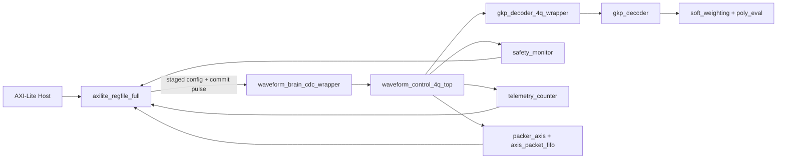

# Waveform Brain v1 Auto Cal

A pre-board FPGA validation stack for GKP-style waveform decoding,
calibration, and board bring-up.

This repository combines:

- AXI-Lite control with explicit CDC boundary wrapper (XPM patterns; full
  CDC sign-off requires Vivado `report_cdc`, which is not checked in)
- pipelined decoder and soft-weighting RTL
- deterministic RTL-to-golden co-simulation (Icarus Verilog)
- pre-board and implementation gate scripts
- sign-off packaging for review and handoff

## Why this repo exists

Waveform Brain started as a compact decode/calibration prototype and has been
iteratively hardened into a bring-up flow with explicit quality gates:

- static and unit validation
- arithmetic and CDC analysis
- pre-board local proof generation
- Vivado implementation gating before board access

## Key capabilities

- **Atomic staged configuration apply**
  - Config writes are staged, then committed in one operation via `WB_REG_CFG_APPLY`.
- **CDC-aware integration top**
  - Dedicated CDC wrapper with XPM-pattern crossings. The simulation library
    in `rtl/xpm_cdc_stubs.v` models real N-flop synchronizer chains, gray-coded
    counter crossings, toggle-based pulse synchronizers, and full req/ack
    handshake behavior; replace it with the Xilinx XPM library in the Vivado
    synthesis flow for sign-off.
- **Pipelined fixed-point decoder path**
  - Decoder, polynomial eval, and soft weighting aligned for deterministic behavior.
- **Health + telemetry visibility**
  - Saturating counters, telemetry windows, FIFO/stream diagnostics.
- **Deterministic co-sim**
  - Golden model vector generation plus Icarus/Vivado simulation (optional for exploration, mandatory for release validation/proof packaging).

## Architecture at a glance



## Quick start

### 1) Prerequisites

- Python 3.10+
- Optional: Verilator (`verilator`) for lint target
- Optional: Icarus Verilog (`iverilog`, `vvp`) for local co-sim
- Vivado (for implementation reports, bitstream, and board sign-off)

### 2) Run the local quality flow

```bash
make test
make lint
make audit-arith
make gen-lut
make extract-regs
make cdc-analyze
```

Or run the consolidated flow:

```bash
make validate
```

For a full local proof bundle (regenerates source-tree hash, the proof
manifest, all required reports, and validates archives):

```bash
make release-validate-local
```

### 3) Run RTL/golden co-sim

```bash
make cosim-vectors
make cosim-gkp
```

Directed edge-case profile:

```bash
python3 scripts/run_gkp_cosim.py --profile edge --count 64
```

### 4) Pre-board gate

```bash
make preboard-check
```

Produces:

- `reports/preboard_local_summary.json`
- `reports/preboard_local_summary.md`

## Vivado/board readiness flow

1. Generate implementation reports in Vivado (`report_cdc`, timing, DRC, etc.).
2. Parse/gate CDC and implementation outputs.
3. Build sign-off package for board review.

Key commands:

```bash
make parse-cdc
make cdc-gate-check
make implementation-gate
make cdc-signoff-package
make vivado-signoff-package
make vivado-bitstream
```

## Register map and config apply model

Primary register header:

- `firmware/registers.h`

Human-readable register guide:

- `docs/REGISTER_MAP.md`

Generated register artifacts:

- `register_map.json`
- `register_map.md`
- `register_map_issues.log`

Atomic config apply helper (userspace):

- `userspace/config_staged_apply.py`

## Important docs

- Overall validation: `docs/VALIDATION_PLAN.md`
- CDC hardening: `docs/CDC_HARDENING_V14.md`
- CDC verification flow: `docs/CDC_VERIFICATION_PLAN.md`
- Pre-board gate: `docs/PREBOARD_GATE_V15.md`
- Pre-board ordering fix: `docs/PREBOARD_GATE_FIX_V16.md`
- Vivado flow fixes: `docs/VIVADO_FLOW_FIX_V17.md`
- AXI-Stream robustness: `docs/STREAMING_ROBUSTNESS_V19.md`
- Atomic config and decoder hardening: `docs/ATOMIC_CONFIG_DECODER_HARDENING_V20.md`
- PRBS and safety hardening: `docs/PRBS_SAFETY_HARDENING_V21.md`
- Changelog: `docs/CHANGELOG_UPGRADE.md`

## Repository layout

```text
rtl/        Core RTL modules, wrappers, CDC boundary logic
firmware/   Register definitions + calibration FSM scaffolding
userspace/  Golden models, packet parsing, staged apply helpers
scripts/    Validation, generation, CDC parsing, packaging, flow gates
tests/      Unit/static regression coverage
constraints/XDC overlays and CDC-related constraints
sim/        Co-simulation testbench and generated vectors
docs/       Design notes, validation plans, versioned hardening docs
```

## Test status expectations

Current baseline (this tree, last `make release-validate-local` run):

- 96 unit/static tests pass via `python3 -m unittest discover -s tests`
- 4 behavioral RTL co-sims pass: `axilite_regfile`, `packer_axis`,
  `safety_monitor`, `prbs_datapath` (each prints `TB_PASS`)
- `gkp_decoder` golden co-sim passes (16/16 vectors, 0 fail)
- `make audit-arith` reports 0 critical / 0 warnings
- `make check-proof-invariant` passes (`source_tree_hash.txt` matches the
  proof manifest, all 25 required artifacts present)
- `dist/` contains validated source and local-proof archives

Strict release flow targets:

- `make release-validate-local`
- `make release-validate-board`
- `make sim-axilite`
- `make sim-packer`
- `make sim-safety`
- `make release-prereqs`
- `make proof-package-board`
- `make validate-release-board`

## Readiness matrix

| Capability | Status | Evidence |
| --- | --- | --- |
| Implemented | Yes | RTL + scripts + userspace in tree |
| Locally tested | Yes | 96 unit/static tests pass; `make validate` |
| Simulated (behavioral RTL) | Yes | 4 behavioral sims + GKP co-sim pass under iverilog |
| CDC modeled in sim | Yes | Real N-flop / handshake / gray / pulse behavior in `rtl/xpm_cdc_stubs.v` |
| CDC signed off (Vivado) | No (gated) | Requires `report_cdc` output checked into `reports/` and passing `cdc-gate-check` |
| Local proof packaged | Yes | `make release-validate-local` green; manifest hash matches tree |
| Vivado proven | No (gated) | Requires CDC/timing/DRC/utilization/clock-interaction reports and passing implementation gate |
| Board proven | No (gated) | Requires board smoke evidence after Vivado-proven build |

## Notes

- `make validate` is intentionally ordered to keep compact-package tests
  meaningful before regenerating heavy artifacts.
- Co-sim is optional for exploration in environments without Icarus; Vivado
  simulator can be used for equivalent checks.
- Co-sim and behavioral simulation are mandatory for release validation and
  proof packaging.
- Proof packaging has two levels:
  - local: `proof-package-local` / `validate-release-local`
  - board: `proof-package-board` / `validate-release-board`
- End-to-end release flows are separated:
  - local: `release-validate-local` or `release-proof-local`
  - board: `release-validate-board` (alias: `release-validate`)
- Strict board proof is fail-closed and requires semantic pass summaries plus
  Vivado reports and raw evidence logs in proof packaging.
- Board access should remain blocked unless implementation gate criteria pass.

## Validation flow matrix

| Flow | Command | Simulator requirement | Vivado reports requirement |
| --- | --- | --- | --- |
| Exploration flow | `make validate` | Optional | Optional |
| Local proof flow | `make release-validate-local` | Mandatory | Not required |
| Board proof flow | `make release-validate-board` | Mandatory | Mandatory |

## Honest status / known limitations

This section is deliberately conservative so the readiness matrix above does
not overstate maturity:

- **XPM CDC primitives in `rtl/xpm_cdc_stubs.v` are simulation models, not
  the Xilinx XPM library.** They model N-flop synchronizer chains, gray-coded
  counter crossings, toggle-based pulse synchronizers, and full req/ack
  handshakes — enough to expose CDC integration bugs in simulation, but they
  do not model metastability and are not bit-accurate replacements. Real
  synthesis must use the actual Xilinx XPM library.
- **No Vivado `report_cdc` output is checked in.** The targets
  `make cdc-analyze` / `make cdc-gate-check` / `make cdc-signoff-package`
  parse Vivado-produced reports; until those reports exist in `reports/`,
  CDC sign-off is not earned and the gate is correctly fail-closed.
- **Vivado/board flows require external toolchain access** (`BOARD_DEVICE`,
  Vivado installation, hardware) and are gated out of CI here.
- **iverilog elaboration emits a couple of "constant selects in always_*"
  informational warnings** on `rtl/safety_monitor.v` and `rtl/gkp_decoder.v`.
  Sims still pass; Vivado/Verilator handle the construct natively.
- **`reports/proof_manifest_local.json` records SHA256 for every required
  artifact**, but the optional `size_bytes` field is currently emitted as
  `null`. Integrity is unaffected — the invariant check is hash-based.

